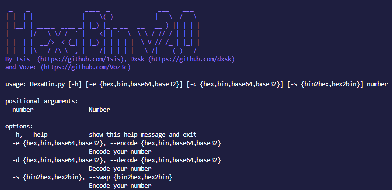

<h1 align="center">Hexabin</h1>
<h3 align="center">

</h3>


# HexaBin is a number converter for binary and hexadecimal

It usefull for :
- convert number to binary or hexadecimal
- convert binary to hexadecimal or the opposite

## How to install it ?

```sh
git clone https://github.com/1sis/HexaBin
cd HexaBin
python3 -m pip install -r requirements.txt
```

## How to use it ?

```py 
python3 HexaBin.py -encode hex 41
python3 HexaBin.py -decode 0x64
```

### Contributors

Dxsk : https://github.com/dxsk
       https://twitter.com/daihyxsk
       
Isis : https://twitter.com/0x1sis

---
Soon : v2 with :
- output file
- more color !
